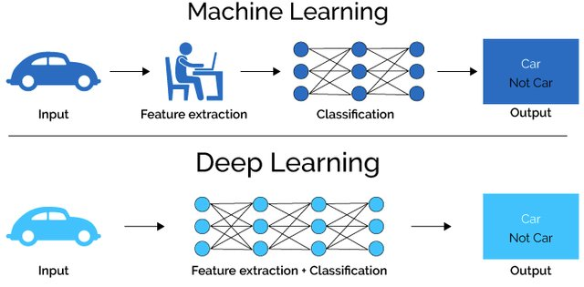
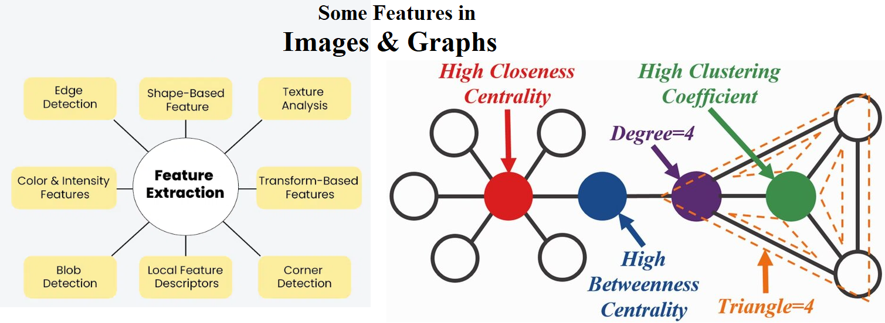

# Introduction

2024 Instructor: [Mahmood Amintoosi](http://mamintoosi.github.io)

---

## Why Deep Learning?

See: [Deep Learning course at FUM-CS](https://fum-cs.github.io/dl/)

## Intro to GNNs

* [Gentle Introduction to GNNs](https://gta-lab.github.io/gnn-intro/)  (by Distill)
* [Understanding Convolutions on Graphs](https://gta-lab.github.io/understanding-gnns/) (by Distill)