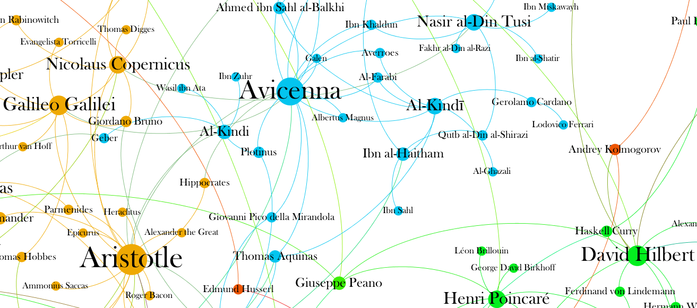
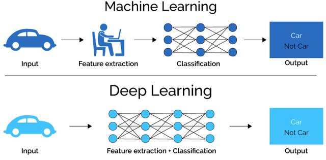
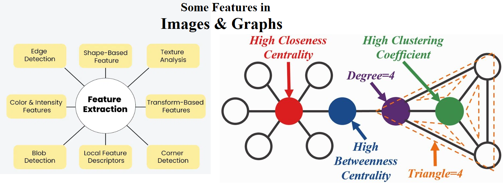

# Introduction

2024 Instructor: [Mahmood Amintoosi](http://mamintoosi.github.io)

---

## Why Graphs?

Graph of mathematicians, [Source: griffsgraphs](https://griffsgraphs.wordpress.com/2012/07/10/the-graph-of-mathematicians/)

## Why Deep Learning?

See: [Deep Learning course at FUM-CS](https://fum-cs.github.io/dl/)

